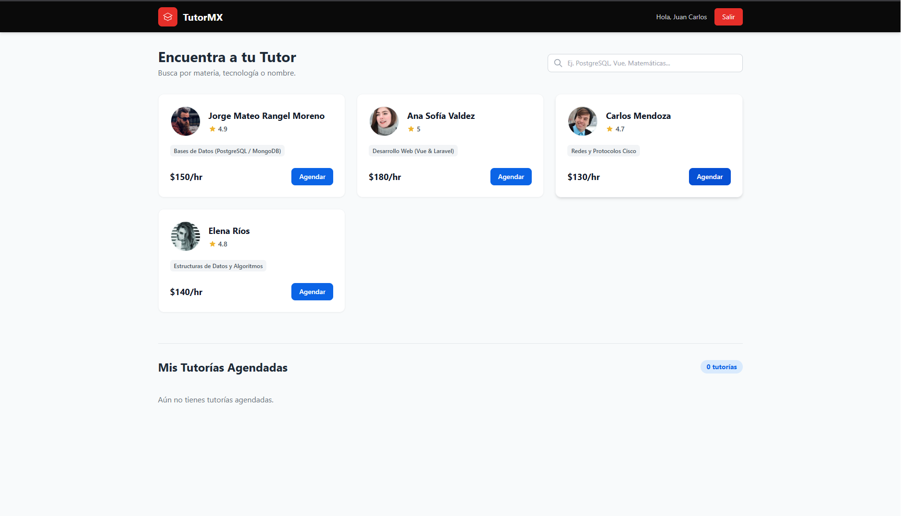

# TutorMX 🎓

**TutorMX** is an interactive, responsive web application designed as a simulator for finding, filtering, and booking academic tutoring sessions in real time. This project was developed as part of the **Web Programming (Unit 3)** curriculum for the Computer Systems Engineering degree at the **Instituto Tecnológico de Morelia**.

The main objective is to demonstrate the practical application of a modular client-side architecture using **HTML5, CSS3 (via Tailwind CSS), and Vanilla JavaScript** for dynamic DOM manipulation and local data persistence.



## 🚀 Key Features

* **Modular & Clean Architecture:** Strict separation of concerns, housing the structure in HTML, visual styling using Tailwind CSS, and behavioral logic within external JavaScript modules.
* **Seamless Simulated Authentication:** A unified Login and Registration system built directly into the landing page (`index.html`). JavaScript handles DOM manipulation to instantly toggle between both views without page refreshes, providing real-time client-side validation for all 5 required fields (*Full Name, Role, Subject of Interest, Email, and Password*).
* **Dynamic DOM Rendering:** The main control panel (`dashboard.html`) dynamically builds and injects tutor profile cards into the DOM using an array of JavaScript objects and a `forEach` loop, eliminating the need for hardcoded, redundant HTML structures.
* **Real-Time Interactive Search:** Features a predictive filtering search bar bound to a JavaScript `input` event. The tutor catalog updates instantaneously on-screen as the user types a specific subject, technology, or teacher's name without requiring a page reload.
* **Interactive Booking Workflow (Modals):** A clean modal popup captures specific session requirements—such as Date, Time, and Topic—with robust client-side validation to prevent incomplete submissions.
* **Local Data Persistence (Web Storage):** Integrates `localStorage` to preserve user profiles and booked appointments locally in the browser, ensuring data survives manual page refreshes for a realistic application experience.
* **Dynamic Appointment Management (Visual CRUD):** A dedicated section titled *"My Scheduled Tutoring"* reads active bookings from storage, paints them onto the screen dynamically, and features dynamic cancel buttons that delete the visual DOM node, clear the record from `localStorage`, and update the overall tutoring counter in real time.
* **Mobile-First & Fully Responsive Layout:** Built using modern utility classes from **Tailwind CSS**, making the entire dashboard fluidly adapt to mobile devices, tablets, and desktop displays.

## 🛠️ Technology Stack

* **HTML5** – Semantic structural markup.
* **Tailwind CSS** – Utility-first CSS framework for rapid, modern, and responsive UI styling.
* **JavaScript (ES6+)** – Client-side logic including native event handling (`input`, `click`, `submit`), DOM tree manipulation, array methods (`forEach`, `find`), and `localStorage` persistence.

## 📁 Project Structure

```text
proyecto-u3/
│
├── index.html          # Login / Registration portal (Dynamic toggle view)
├── README.md           # Repository documentation
│
├── pages/
│   └── dashboard.html  # Main panel (Search filter, tutor cards, and booked sessions)
│
└── js/                 # Client-side script modules
    └── dashboard.js    # Data rendering, real-time filtering, modals, and local storage logic
```

## 💻 Code Preview: Data Simulation

The tutoring staff and their technical domains (such as *Databases, Web Development, Cisco Networking, and Data Structures*) are modeled natively using optimized structures:

```javascript
const tutores = [
  {
    id: 1,
    nombre: "Jorge Mateo Rangel Moreno",
    materia: "Bases de Datos (PostgreSQL / MongoDB)",
    calificacion: 4.9,
    precio: "$150/hr",
    foto: "[https://i.pravatar.cc/150?img=11](https://i.pravatar.cc/150?img=11)"
  },
  {
    id: 2,
    nombre: "Ana Sofía Valdez",
    materia: "Desarrollo Web (Vue & Laravel)",
    calificacion: 5.0,
    precio: "$180/hr",
    foto: "[https://i.pravatar.cc/150?img=5](https://i.pravatar.cc/150?img=5)"
  }
  // ... extra mock data
];
```

## ⚙️ Local Installation & Setup

Since this is a pure client-side application, it does not require complex backend servers (like Node.js or PHP) to execute:

1. Clone this repository to your local machine:
   ```bash
   git clone [https://github.com/your-username/tutor-mx.git](https://github.com/your-username/tutor-mx.git)
   ```
2. Navigate into the project directory.
3. Simply double-click or open `index.html` using your preferred web browser (or launch it via an extension like *Live Server* in VS Code).

---
**Developed by:** Israel Ramírez Morales & Gabriel Chacón Arellano – Computer Systems Engineering Students at [Instituto Tecnológico de Morelia](https://www.morelia.tecnm.mx/).